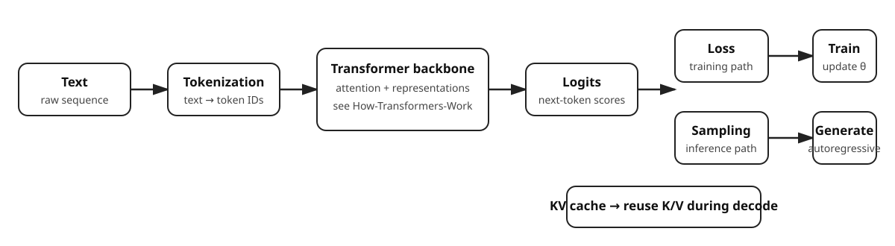

# How-LLMs-Work

**A from-scratch exploration of LLM mechanics: tokenization, causal language modeling, generation, sampling, and KV-cache inference using Python and NumPy.**

How-LLMs-Work is a learning-oriented repository for making the path from text to next-token generation explicit.

It is intentionally small. The goal is not to reproduce a production LLM, but to expose the mechanics that sit around a Transformer language model:

~~~
text
  ↓
tokenization
  ↓
token IDs
  ↓
causal training examples
  ↓
language-model objective
  ↓
Transformer representations
  ↓
logits
  ↓
next-token selection
  ↓
autoregressive generation
  ↓
KV cache during decode
~~~

## Where This Repository Fits

The portfolio separates two closely related questions:

| Repository | Main question |
| --- | --- |
| How-Transformers-Work | How does a Transformer compute representations and learn through attention and backpropagation? |
| How-LLMs-Work | How do language-model training objectives, token selection, generation, and KV-cache inference fit around that Transformer? |

The optional integration in this repository can run the current How-Transformers-Work model as an external backbone.

## What Is Implemented

### Tokenization and vocabulary

- word-level tokenization with punctuation splitting
- vocabulary-to-ID mapping
- unknown-token handling
- reversible ID-to-token decoding

### Language-model training concepts

- causal next-token examples
- sliding context windows
- batching
- cross-entropy objective from logits
- perplexity
- token-level accuracy
- simple trainable language-model baselines
- positional trainable language-model baseline

### Transformer and attention building blocks

- trainable Q/K/V projection
- scaled dot-product attention
- causal masking
- trainable multi-head attention
- reusable Transformer language-model interface
- optional How-Transformers-Work integration

### Generation

- next-token prediction
- greedy generation
- temperature sampling
- Top-K sampling
- Top-P / nucleus sampling
- pluggable sampling strategies
- EOS stopping

### Efficient autoregressive inference

- KV cache
- cached scaled dot-product attention
- cached multi-head attention
- prefill / decode API
- cached generation
- bounded context windows with generation-layer replay

The cached path is intentionally an **attention-centric educational inference model**. It is not presented as a complete production Transformer block.

## The Core Language-Model Objective

For a token sequence:

~~~
input:   x₁ x₂ x₃
target:    x₂ x₃ x₄
~~~

the model learns:

$$
P(x_t \mid x_1,\ldots,x_{t-1})
$$

The mean causal cross-entropy is:

$$
\mathcal{L}
=
-\frac{1}{n}
\sum_{t=1}^{n}
\log P(x_t \mid x_{<t})
$$

Perplexity is:

$$
\mathrm{PPL} = e^{\mathcal{L}}
$$

The repository also reports token accuracy as a complementary diagnostic:

$$
\mathrm{accuracy}
=
\frac{\text{number of correct next-token predictions}}{\text{number of prediction positions}}
$$

These metrics answer different questions: loss and perplexity measure the quality of the predicted distribution, while token accuracy measures how often the highest-scoring token is correct.

## From Logits to a Token

The model produces a vocabulary-sized vector:

$$
z = [z_1,z_2,\ldots,z_V]
$$

Greedy selection chooses:

$$
\hat{y} = \arg\max_i z_i
$$

Sampling strategies modify the distribution before selecting a token.

### Temperature

$$
p_i
=
\frac{e^{z_i/T}}
{\sum_j e^{z_j/T}}
$$

Lower temperature sharpens the distribution; higher temperature makes it flatter.

### Top-K

Only the K highest-scoring candidates are kept before normalization and sampling.

### Top-P

Candidates are sorted by probability and the smallest prefix whose cumulative probability reaches p is retained.

The implementations are deliberately explicit so the difference between these strategies can be inspected and tested directly.

## Autoregressive Generation

Generation repeatedly feeds the selected token back into the model:

$$
x_{t+1}
\sim
P(\cdot \mid x_1,\ldots,x_t)
$$

Conceptually:

~~~
prompt
  ↓
model
  ↓
logits
  ↓
sampling strategy
  ↓
selected token
  ↓
append
  ↓
repeat
~~~

The public generation API separates model inference from token-selection strategy so the same generator can use greedy, temperature, Top-K, or Top-P behavior.

## KV Cache

During autoregressive decoding, previously computed Key and Value states can be reused instead of recomputing them for every new token.

Without reuse, the growing prefix is repeatedly processed:

~~~
step 1 → token 1
step 2 → tokens 1..2
step 3 → tokens 1..3
step 4 → tokens 1..4
~~~

With a KV cache:

~~~
prompt
  ↓
prefill
  ↓
store K/V
  ↓
new token
  ↓
compute new K/V
  ↓
append to cache
  ↓
attend over cached history
~~~

For one head:

$$
K_{\mathrm{cache}}
=
[K_1;K_2;\ldots;K_t]
$$

$$
V_{\mathrm{cache}}
=
[V_1;V_2;\ldots;V_t]
$$

and a new query uses:

$$
\mathrm{Attention}(Q_t,K_{\mathrm{cache}},V_{\mathrm{cache}})
=
\mathrm{softmax}
\left(
\frac{Q_tK_{\mathrm{cache}}^\top}
{\sqrt{d_h}}
\right)
V_{\mathrm{cache}}
$$

The repository makes the two phases explicit:

**Prefill** processes the prompt and populates the cache.

**Decode** processes one new token at a time and reuses the cached history.

The sliding-window generator deliberately keeps the cache bounded. When the context limit is reached, the generation layer replays the newest window rather than pretending that a small NumPy implementation has production-grade cache eviction.

## Training and Inference Are Different Paths

The project keeps the conceptual distinction visible:

~~~
TRAINING
forward
  ↓
loss
  ↓
gradient
  ↓
parameter update
  ↓
repeat

INFERENCE
prompt
  ↓
forward
  ↓
logits
  ↓
sampling
  ↓
new token
  ↓
KV cache
  ↓
repeat
~~~

The local simple and positional language models demonstrate explicit trainable objectives.

The full Transformer training implementation lives in How-Transformers-Work.

## Project Structure

~~~
How-LLMs-Work/
│
├── src/
│   ├── attention/
│   │   ├── qkv_projection.py
│   │   ├── scaled_dot_product.py
│   │   ├── multi_head.py
│   │   ├── kv_cache.py
│   │   ├── cached_attention.py
│   │   └── cached_multi_head.py
│   │
│   ├── tokenization/
│   │   ├── tokenizer.py
│   │   └── vocabulary.py
│   │
│   ├── llm/
│   │   ├── simple_language_model.py
│   │   ├── positional_language_model.py
│   │   ├── transformer_backbone.py
│   │   ├── transformer_language_model.py
│   │   └── cached_transformer_*.py
│   │
│   ├── training/
│   │   ├── dataset.py
│   │   ├── batch.py
│   │   ├── language_model_objective.py
│   │   ├── language_model_training.py
│   │   ├── evaluation.py
│   │   ├── metrics.py
│   │   ├── model_evaluation.py
│   │   └── optional Transformer integration
│   │
│   ├── inference/
│   │   ├── next_token.py
│   │   ├── sampling.py
│   │   ├── sampling_strategy.py
│   │   ├── top_k_sampling.py
│   │   ├── top_p_sampling.py
│   │   ├── generator.py
│   │   ├── cached_generator.py
│   │   └── prefill_decode.py
│   │
│   └── experiments/
│       └── focused step-by-step demonstrations
│
├── tests/
├── docs/
│   └── assets/
├── CHANGELOG.md
├── LICENSE
└── pyproject.toml
~~~

## Recommended Learning Order

### 1. Tokenization

Start with:

~~~
src/tokenization/
src/experiments/tokenization_demo.py
~~~

See how text is converted into token IDs and back again.

### 2. Causal language modeling

Explore:

~~~
src/training/dataset.py
src/training/causal_examples.py
src/training/language_model_objective.py
~~~

Understand the input/target shift and the training objective.

### 3. Simple trainable baselines

Study:

~~~
src/llm/simple_language_model.py
src/llm/positional_language_model.py
~~~

These make it easier to understand what changes when positional information is introduced.

### 4. Attention

Study:

~~~
src/attention/qkv_projection.py
src/attention/scaled_dot_product.py
src/attention/multi_head.py
~~~

Then compare the cached variants.

### 5. Transformer core

Move to:

~~~
How-Transformers-Work
~~~

This is where the portfolio's explicit Transformer computation graph, trainable attention, backward propagation, and gradient verification live.

### 6. Generation

Study:

~~~
src/inference/next_token.py
src/inference/sampling_strategy.py
src/inference/generator.py
~~~

### 7. Cached decoding

Finish with:

~~~
src/attention/kv_cache.py
src/inference/prefill_decode.py
src/inference/cached_generator.py
~~~

This shows how a language model moves from basic autoregressive inference toward reuse of previously computed Key/Value states.

## Experiments

Run focused demonstrations with:

~~~bash
python -m src.experiments.tokenization_demo
python -m src.experiments.objective_demo
python -m src.experiments.qkv_projection_demo
python -m src.experiments.scaled_attention_demo
python -m src.experiments.multi_head_attention_demo
python -m src.experiments.next_token_demo
python -m src.experiments.temperature_demo
python -m src.experiments.top_k_demo
python -m src.experiments.top_p_demo
python -m src.experiments.kv_cache_demo
python -m src.experiments.prefill_decode_demo
python -m src.experiments.cached_generation_demo
python -m src.experiments.cached_sampling_demo
python -m src.experiments.model_evaluation_demo
~~~

The optional integration demos require a sibling checkout of:

~~~
How-Transformers-Work/
~~~

Then:

~~~bash
python -m src.experiments.how_transformers_work_integration
python -m src.experiments.end_to_end_transformer_training
~~~

The external repository is deliberately not a required dependency for the standalone project or CI.

## Testing

Run:

~~~bash
python -m pytest
~~~

The test suite covers:

- vocabulary and tokenization
- causal dataset construction
- language-model objectives
- evaluation and metrics
- trainable Q/K/V projections
- scaled and multi-head attention
- KV-cache state transitions
- cached inference
- prefill/decode
- generation
- sampling strategies
- sliding context-window behavior
- optional Transformer integration boundaries

The exact test count is intentionally not hard-coded in this README; CI is the source of truth for the current count.

## Code Quality

The project uses:

- Python 3.12+
- NumPy
- pytest
- Ruff
- mypy

CI runs:

~~~bash
python -m pytest
python -m ruff check .
python -m mypy src
~~~

The integration tests for How-Transformers-Work are optional and skip when the sibling repository is not available.

## Design Principles

### Make the computation visible

Important mathematical steps should be inspectable instead of hidden behind a large framework.

### Keep boundaries small

Examples of explicit contracts include:

~~~
text → token IDs
token IDs → logits
logits → probabilities
probabilities → next token
prompt → cache state → decode
~~~

### Test behavior, not only shapes

The project checks probability normalization, causal visibility, gradient-related mechanics, cache state, generation behavior, and evaluation outputs.

### Separate core Transformer work from LLM mechanics

The project intentionally complements rather than duplicates How-Transformers-Work.

## What This Project Is Not

This repository is **not**:

- a production-scale LLM
- a pretrained foundation model
- a production tokenizer such as BPE or SentencePiece
- a distributed training system
- a GPU inference engine
- a serving stack
- a benchmark claim for model quality at real-world scale

Its value is in making the underlying mechanics explicit and testable.

## Current Scope

Implemented concepts:

- ✅ tokenization and vocabulary
- ✅ causal next-token datasets
- ✅ cross-entropy and perplexity
- ✅ token-level accuracy
- ✅ simple trainable language models
- ✅ Q/K/V projection
- ✅ scaled dot-product attention
- ✅ trainable multi-head attention
- ✅ next-token prediction
- ✅ greedy generation
- ✅ temperature sampling
- ✅ Top-K sampling
- ✅ Top-P sampling
- ✅ KV cache
- ✅ prefill / decode
- ✅ cached generation
- ✅ bounded sliding-window generation
- ✅ optional integration with How-Transformers-Work
- ✅ automated tests
- ✅ CI, linting, and type checking

## Mental Model

A useful conceptual decomposition is:

$$
\boxed{
\text{LLM system}
=
\text{tokenization}
+
\text{language-model training}
+
\text{Transformer inference}
+
\text{token selection}
}
$$

During autoregressive generation:

$$
\boxed{
x_{t+1}
\sim
P(\cdot \mid x_1,\ldots,x_t)
}
$$

and during cached decoding:

$$
\boxed{
\text{reuse previous K/V states}
}
$$

That is the journey this repository is designed to make understandable.

## License

MIT. See [LICENSE](LICENSE).
